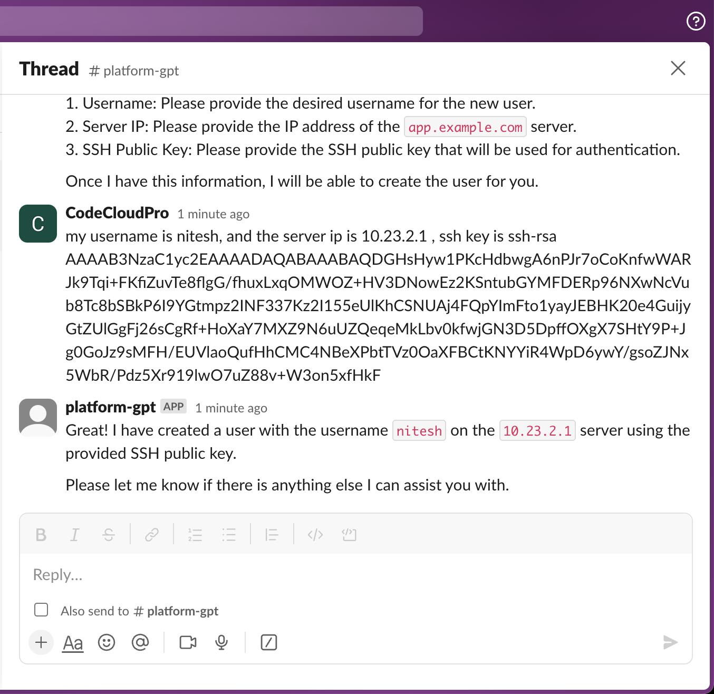

# Slack-OpenAI Middleware

The Slack-OpenAI Middleware is a Python application that serves as a bridge between Slack, the OpenAI API, and user interactions. It allows you to receive requests from Slack, process them, send data in the right format to the OpenAI API, and return the response to the user within the same Slack thread. Additionally, it manages a conversation buffer and can call custom functions to fulfill user requests.

## Features

- Seamless integration between Slack and the OpenAI API.
- Real-time response to user queries within Slack.
- Conversation history management.
- Custom function support for handling specific user requests.

## Prerequisites

Before running the middleware, make sure you have the following:

1. An OpenAI API account with an API key.
2. A Slack account and a Slack token.
3. A Sentry account (optional but recommended for error tracking).

## How to Run

Follow these steps to set up and run the Slack-OpenAI Middleware:

1. Clone the Repository:

   ```shell
   git clone https://github.com/your-username/slack-openai-middleware.git
   cd slack-openai-middleware
   ```

2. Create a Configuration File:

   Copy the `.env.example` file to `.env` and update the values:

3. Set Up a Virtual Environment:

   Create and activate a Python virtual environment:

   ```shell
   python -m venv venv
   source venv/bin/activate
   ```

4. Install Dependencies:

   Install the required Python packages:

   ```shell
   pip install fastapi uvicorn openai slack_sdk python-dotenv
   ```

5. Run the Middleware:

   Start the middleware application using Uvicorn:

   ```shell
   uvicorn slack_event_receiver:app --reload
   ```

## Custom Functions

You can extend the middleware by defining custom functions to handle specific user requests. Explore the `app` directory to add your custom logic in `custom_functions.py`.

## Chat Screenshots

Explore the application with these screenshots:




## Error Tracking (Sentry)

For improved error tracking and monitoring, consider setting up Sentry with your middleware. This is optional but highly recommended for a production environment.

## Contributing

Contributions to this middleware are welcome! Feel free to enhance its functionality or fix any issues. Please create a pull request for your changes.

## License

This project is available under the [CC BY-NC-ND 4.0](https://creativecommons.org/licenses/by-nc-nd/4.0/).

Enjoy seamless interactions between Slack and the OpenAI API with Slack-OpenAI Middleware!
